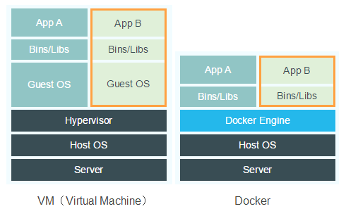

# História

Começou a ser construído em 2008 quando Solomon Hykes fundou a dotCloud, empresa especializada em Paas(Platform as a
Service).

Em 2013 nasce efetivamente o docker quando a dotCloud tornou o core da sua plataforma Open-Source(Docker)

Quinze meses após o lançamento da versão 0.1 foi lançado a versão 1.0 que foi a primeira considerada "Production ready".
Nesse ponto ela já era utilizada amplamente por grandes empresas, exemplo Spotify.

# Container

O agrupamento de uma aplicação com suas dependências, que compartilham o kernel do sistema operacional do host.

| VMs                                                                          | Containers                                            |
|------------------------------------------------------------------------------|-------------------------------------------------------|
| Necessário emular um novo sistema operacional e virtualizar todo o hardware. | Utiliza os recursos compartilhados da própria máquina |
| Aplicação, dependências e SO sendo emulada.                                  | Emula apenas aplicação e dependências                 |
| Sua aplicação depende do Sistema Operacional em que está rodando.            | Aplicação não depende do SO                           |

# Instalação

No site oficial do docker há um tutorial para instalação do docker de acordo com seu sistema
operacional. https://docs.docker.com/get-docker/

# Hello World

Digite na linha de comando:
> docker container run hello-world

## Entendendo o que aconteceu

* O comando docker se comunica com o daemon do docker informando a ação desejada
* O daemon verifica se a imagem *hello-world* existe localmente.
    * Caso não exista ele faz o download da imagem diretamente do Docker Hub
* Cria um container utilizando a imagem *hello-world*
* Envia a saída para o comando docker, que imprime a mensagem no terminal.

## Visualizar imagens

Listar as imagens presentes no host. Observe a imagem do *hello-world* que foi criada.

> docker image ls

Resultado:

| REPOSITORY     | TAG              | IMAGE ID                | CREATED         | SIZE              |
|----------------|------------------|-------------------------|-----------------|-------------------|
| hello-world    | latest           | feb5d9fea6a5            | 7 months ago    | 13.3kB            |
| Nome da imagem | Versão da imagem | Identificador da imagem | Data de criação | Tamanho da imagem |

## Visualizar containers

Lista os containers que estão em execução. Observe que nosso container criado anteriormente não está mais em execução.

> docker container ls

Resultado:

| CONTAINER ID               | IMAGE                                       | COMMAND             | CREATED         | STATUS       | PORTS           | NAMES             |
|----------------------------|---------------------------------------------|---------------------|-----------------|--------------|-----------------|-------------------|
| Identificação do container | Imagem utilizada para execução do container | Comando em execução | Data de criação | Status atual | Porta utilizada | Nome do container |

Com a opção *-a* é possível visualizar não somente os containers em execução.

> docker container ls -a

| CONTAINER ID               | IMAGE                                       | COMMAND             | CREATED         | STATUS       | PORTS           | NAMES             |
|----------------------------|---------------------------------------------|---------------------|-----------------|--------------|-----------------|-------------------|
| 55860638a0e2 | hello-world | "/hello" | 18 minutes ago | Exited (0) 18 minutes ago |  | focused_hawking |

# Comandos

Comandos: https://docs.docker.com/engine/reference/commandline/run/

## Executando em modo interativo

Modo utilizando para testes, aonde é possível ter acesso ao container via console.

* -t — Disponibiliza um console para nosso container
* -i — Mantém o STDIN aberto mesmo que você não esteja conectado no container

> docker container run -ti

## Executando em segundo plano

* -d — Roda o container em segundo plano

> docker container run -d

## Exemplo CentOS

Executando uma imagem do CentOS na sua máquina.

> docker container run -ti centos:7

Utilize o comando abaixo para verificar se está rodando a imagem correta
> cat /etc/redhat-release

Para sair sem finalizar o container aperte ctrl+p+q.

Para voltar ao container digite:

> docker container attach (CONTAINER ID)

Caso você digite exit, você irá finalizar o processo bash que está rodando, nesse caso o container vai encerrar sua
execução. Confirme isso listando os containers ativos.

## Criando um container para uso posterior

Nos casos anteriores criamos um container e já o executamos. Porém, existem situações aonde só iremos criar o container
e sua execução será feita em um segundo momento.

> docker container create -ti ubuntu

Para iniciar o container basta digitar o comando

> docker container start (CONTAINER ID)

## Parando, reiniciando e pausando

> docker container stop (CONTAINER ID)

> docker container restart (CONTAINER ID)

> docker container pause (CONTAINER ID)

## Removendo um container

Para remover um container utilize o comando abaixo.

> docker container rm (CONTAINER ID)

Caso o container esteja em execução esse comando dará um erro, será necessário adicionar o parâmetro *-f* para forçar a
remoção.

## Visualizando logs

Para visualizar os logs de um container utilize o comando abaixo.

> docker container logs (CONTAINER ID)

Caso queira verificar os logs continuamente adicione o parâmetro *-f*

## Visualizando recursos

Para visualizar o consumo de recursos de todos os containers ativos digite

> docker container stats

Caso queira visualizar o de apenas um container basta adicionar o seu container id ao final.

## Alterando memória e CPU

É possível alterar os parâmetros de uso de memória e cpu de um container.

Exemplo:

Criando um container

> docker container run -ti --name memcpu ubuntu

Verificando os parâmetros de memória e cpu

> docker container inspect memcpu | grep -i mem

> docker container inspect memcpu | grep -i cpu

Alterando os parâmetros de memória e cpu

> docker container run -ti -m 512M --cpus=0.5 --name newmemcpu ubuntu

É possível alterar esses parâmetros depois que o container já está sendo executando através do comando

> docker container update -m 256M --cpus=0.4 newmemcpu